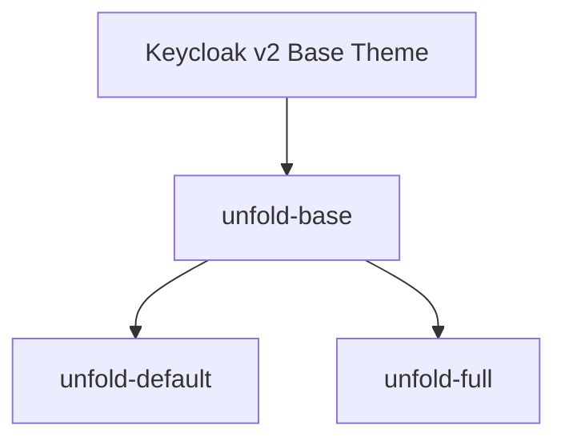
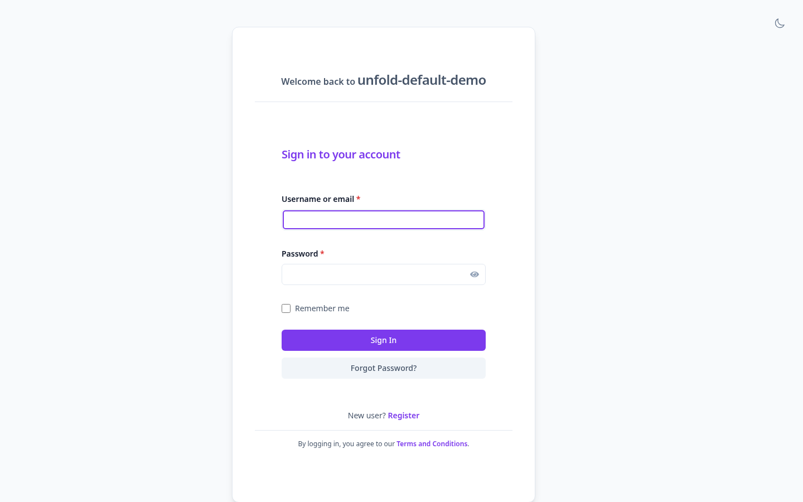
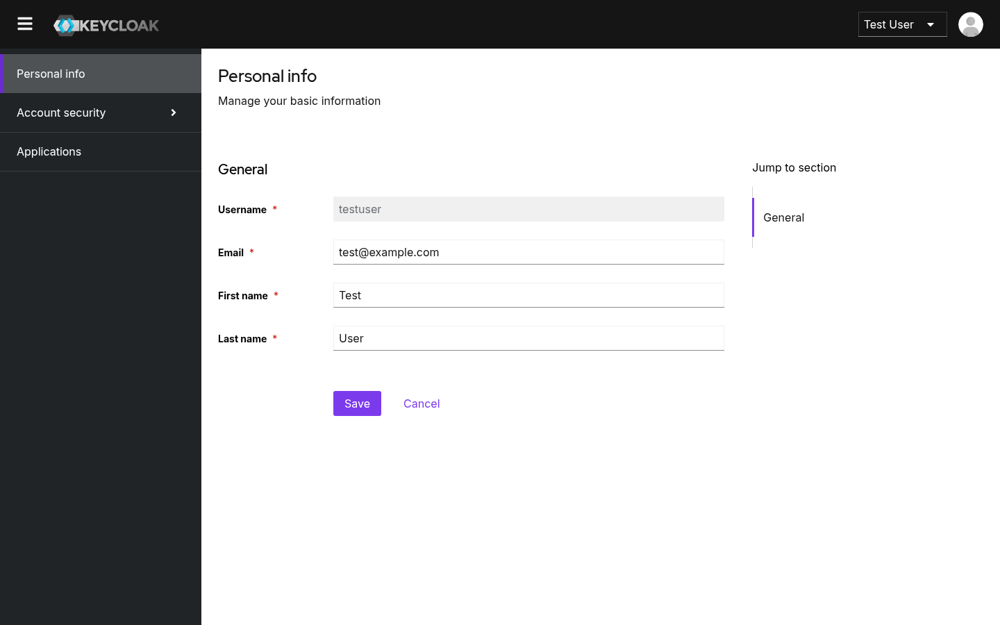
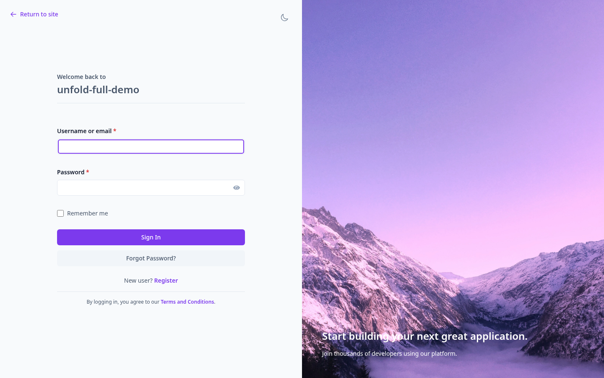
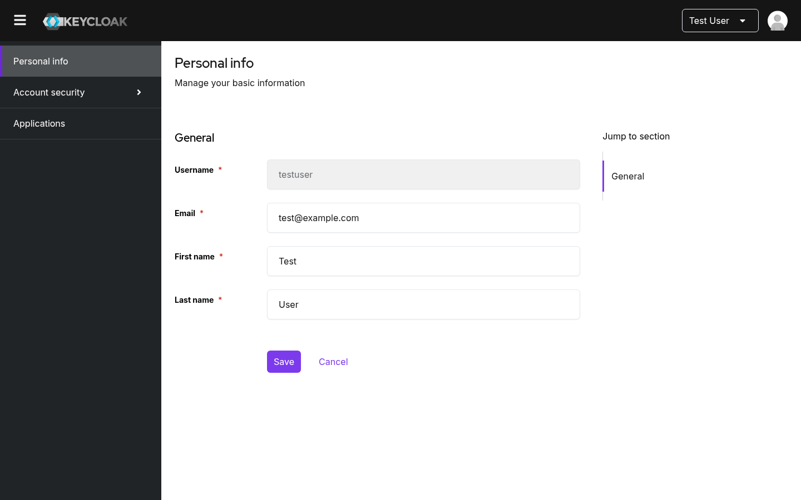

# Keycloak Unfold

> [!WARNING]
> **Disclaimer**: This project is experimentally written almost entirely by AI. Any usage of this software should keep this in mind, and the execution of this software is at your own risk.

Keycloak Unfold is a modular custom theme for Keycloak designed to emulate the clean, modern aesthetics of the popular [Django Unfold Theme](https://github.com/unfoldadmin/django-unfold). It builds on Keycloak's native `v2` theme and overrides PatternFly 5 CSS variables to deliver a premium user interface out of the box.

---

## Key Features

- **Unfold Aesthetics**: Clean layouts, high-contrast borders, refined typography, and slate neutral tones.
- **Dark Mode Support**: Seamless integration supporting both automatic detection via system settings (`prefers-color-scheme`) and manual overrides via a interactive toggle.
- **Tailwind CSS Utility Integration**: Build custom styles using Tailwind CSS v4 in your FreeMarker templates (`.ftl`).
- **Flexible Theme Variants**: Toggle between standard centered and split-screen visual flows.
- **Preconfigured Local Development**: Fast spin-up with Docker Compose and pre-populated demo realms.
- **Comprehensive E2E Suite**: Preconfigured Playwright tests validating functionality, styles, and dark mode toggles.

---

## Keycloak Compatibility

- **Keycloak Version**: 26+ (Tested and verified against `v26.7.0`)
- **Base Theme Dependency**: Keycloak's default `v2` theme.

For detailed version alignments, see [UNFOLD_VERSION.md](file:///home/fabio/Workspace/keycloak-unfold/UNFOLD_VERSION.md).

---

## Theme Architecture

The theme registration is defined in the [keycloak-themes.json](file:///home/fabio/Workspace/keycloak-unfold/src/main/resources/META-INF/keycloak-themes.json) configuration. The codebase follows a modular inheritance-based architecture:



1. **`unfold-base`**: The core theme. It contains all modified FreeMarker templates (`.ftl`) for login, account, admin, and email modules, as well as shared CSS files, logos, and scripts (like dark mode logic).
2. **`unfold-default`**: Inherits from `unfold-base`. Delivers a clean, centered login layout. Keeps the Admin and Account consoles visually aligned with default Keycloak layout patterns, overriding only colors and typography.
3. **`unfold-full`**: Inherits from `unfold-base`. Delivers a premium split-screen layout with a configurable hero image background on the left and login actions on the right.

---

## Configuration & Customization Guide

### CSS Overrides & Design System

All key styling variables are defined in the central [unfold-common.css](file:///home/fabio/Workspace/keycloak-unfold/theme/unfold-base/common/resources/css/unfold-common.css) file. You can adjust colors, fonts, and border-radii by editing the custom properties:

```css
:root {
  /* Font Family */
  --pf-v5-global--FontFamily--sans-serif: 'Inter', sans-serif;

  /* Primary Theme Accent */
  --color-primary-600: #7c3aed; /* Light Mode Accent */
  --color-primary-500: #8b5cf6; /* Dark Mode Accent */

  /* Neutral Slates */
  --color-base-50: #f8fafc;
  --color-base-900: #0f172a;
}
```

### Customizing Variant Assets & Metadata

You can customize the background image or resources for specific variants using `theme.properties` configuration files:

- **`unfold-full` Background**: You can customize the split-screen image by modifying `bgImage=img/login-bg.jpg` in [theme/unfold-full/login/theme.properties](file:///home/fabio/Workspace/keycloak-unfold/theme/unfold-full/login/theme.properties).
- **Logos**: Place your custom SVG logo at `theme/unfold-base/login/resources/img/logo.svg`. The header leverages CSS classes to support light/dark variants (`#kc-logo-light` and `#kc-logo-dark`).

---

## Local Development

Ensure you have **Docker**, **Docker Compose**, and **Node.js** (v18+) installed.

### 1. Spin up Keycloak Dev Instance

Run the following command to start Keycloak:

```bash
docker compose up
```

This mounts local theme folders directly and imports the demo realm configurations from the [demo/](file:///home/fabio/Workspace/keycloak-unfold/demo/) directory. Keycloak is available at `http://localhost:8080`.

- **Admin Console Login**: `admin` / `admin`
- **Demo User Login**: `testuser` / `password`

### 2. Live Testing URLs

Three pre-configured demo realms are imported for verification:

- **Default Theme (Centered Login)**: [Default Account Console Demo](http://localhost:8080/realms/unfold-default-demo/account/)
- **Full Theme (Split-Screen Login)**: [Full Account Console Demo](http://localhost:8080/realms/unfold-full-demo/account/)
- **Standard Base Demo**: [Demo Realm Account](http://localhost:8080/realms/demo/account/)

---

## Tailwind CSS Build Pipeline

The project uses **Tailwind CSS v4** to build utilities. If you modify `.ftl` templates and add custom classes, you must compile the CSS.

- **Build CSS**:

  ```bash
  npm run build
  ```

  This runs `npx @tailwindcss/cli` minifying the output stylesheet.

- **Watch and Auto-compile (Recommended for development)**:
  ```bash
  npx @tailwindcss/cli -i ./theme/unfold-base/login/resources/css/tailwind-input.css -o ./theme/unfold-base/login/resources/css/tailwind.css --watch
  ```

---

## Packaging & Production Deployment

To deploy this theme on a production Keycloak cluster, package it as a JAR file (Keycloak best practice).

### Option A: Pack using NPM (Recommended for Frontend Devs)

Run the NPM packager script:

```bash
npm run package
```

This builds CSS, prepares the `META-INF` files, and generates a packaged archive (e.g., `keycloak-unfold-v26.7.0.jar`) in the root directory.

### Option B: Pack using Maven (Recommended for Java/DevOps Pipelines)

Compile using Maven (builds and runs tests under `/target`):

```bash
mvn clean package
```

This compiles the output JAR into the `target/` directory: `target/keycloak-unfold-v26.7.0.jar`.

### Production Installation Steps

1. Copy the compiled `.jar` file to the `providers/` directory of your Keycloak installation.
2. Run the Keycloak build step to register the new theme provider:
   ```bash
   bin/kc.sh build
   ```
3. Restart/Start Keycloak in production mode:
   ```bash
   bin/kc.sh start
   ```

---

## Testing & Quality Assurance

### Run Playwright E2E Tests

To install dependencies and execute the E2E verification test suite (which validates layout styling, button behaviors, and dark mode toggles):

```bash
npm install
npm run test
```

For interactive test debugging, run:

```bash
npx playwright test --ui
```

### Linters & Formatters

Keep the code base clean by running validation scripts before submitting pull requests:

- **Lint all files**: `npm run lint` (validates JavaScript with ESLint and CSS with Stylelint).
- **Check formatting**: `npm run format:check` (verifies compliance with Prettier formatting rules).
- **Auto-format code**: `npm run format` (formats all workspace stylesheets, templates, and scripts).

---

## Visual Previews

### Unfold Default Variant

The `unfold-default` variant focuses on a clean, "Keycloak-native" feel with custom accent colors.

| Login Page                                               | Account Console                                              |
| -------------------------------------------------------- | ------------------------------------------------------------ |
|  |  |

### Unfold Full Variant

The `unfold-full` variant provides a highly customized split-screen, premium visual layout.

| Login Page                                         | Account Console                                        |
| -------------------------------------------------- | ------------------------------------------------------ |
|  |  |

---

## Credits & License

- Designed and inspired by the excellent [Django Unfold Theme](https://github.com/unfoldadmin/django-unfold).
- Distributed under the [MIT License](LICENSE).
- For reporting security vulnerabilities, please refer to our guidelines in [SECURITY.md](file:///home/fabio/Workspace/keycloak-unfold/SECURITY.md).
