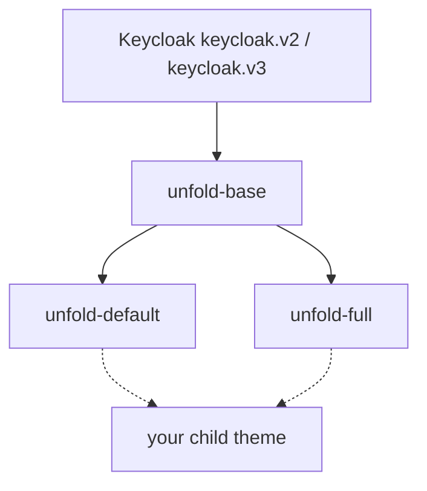
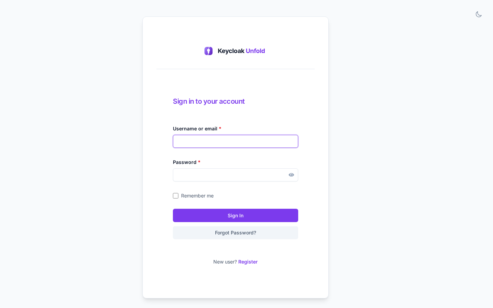
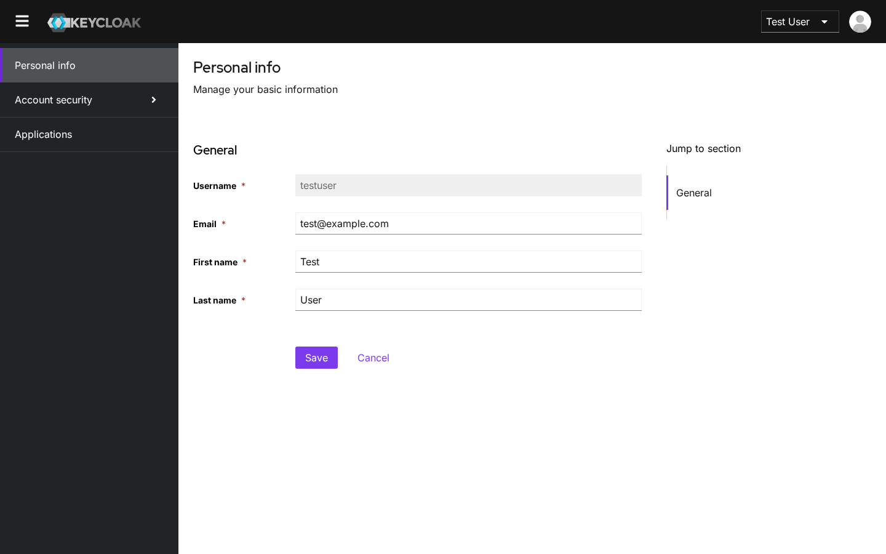
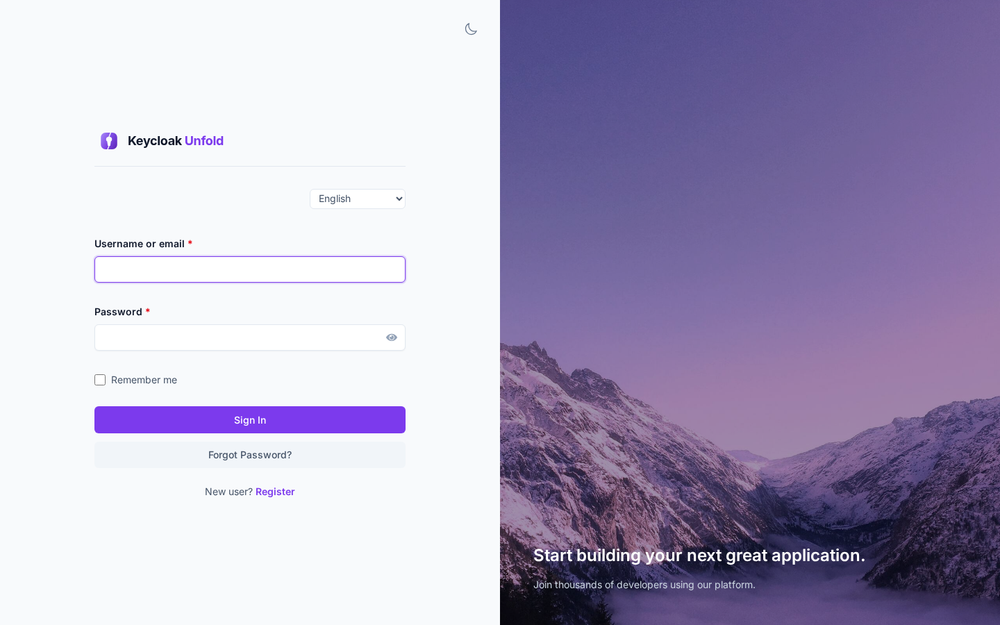
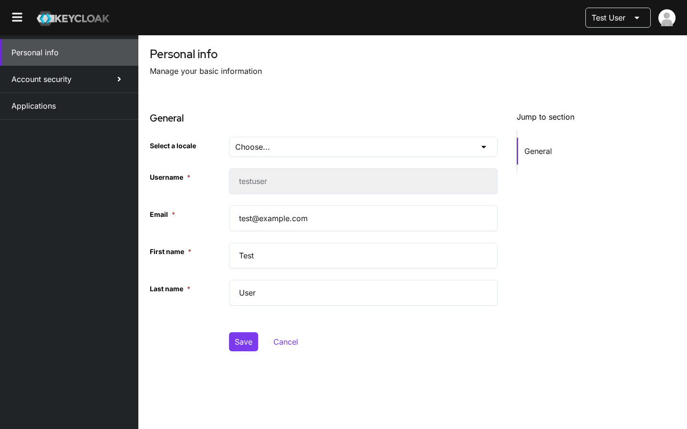

# Keycloak Unfold

> [!WARNING]
> **Disclaimer**: This project is experimentally written almost entirely by AI. Any usage of this software should keep this in mind, and the execution of this software is at your own risk.

Keycloak Unfold is a modular custom theme for Keycloak designed to emulate the clean, modern aesthetics of the popular [Django Unfold Theme](https://github.com/unfoldadmin/django-unfold). It builds on Keycloak's native `v2` theme and overrides PatternFly 5 CSS variables to deliver a premium user interface out of the box.

---

## Key Features

- **Unfold Aesthetics**: Clean layouts, high-contrast borders, refined typography, and slate neutral tones.
- **Dark Mode Support**: Seamless integration supporting both automatic detection via system settings (`prefers-color-scheme`) and manual overrides via a interactive toggle.
- **Tailwind CSS Utility Integration**: Build custom styles using Tailwind CSS v4 in your FreeMarker templates (`.ftl`).
- **Flexible Theme Variants**: Toggle between standard centered and split-screen visual flows.
- **Preconfigured Local Development**: Fast spin-up with Docker Compose and pre-populated demo realms.
- **Comprehensive E2E Suite**: Preconfigured Playwright tests validating functionality, styles, and dark mode toggles.

---

## Compatibility Matrix

Keycloak Unfold is versioned independently using [Semantic Versioning (SemVer)](https://semver.org/) starting from `0.0.1`.

| Theme Version              | Supported Keycloak | Tested Keycloak | Base Theme | PatternFly Version         | Django Unfold Alignment | Support Status |
| :------------------------- | :----------------- | :-------------- | :--------- | :------------------------- | :---------------------- | :------------- |
| `0.0.x` (current: `0.0.1`) | `26.x` (26.0.0+)   | `v26.8.0`       | `v2`       | PatternFly 5 (`--pf-v5-*`) | `v0.101.0`              | 🟢 Active      |

### Versioning Strategy

- **Major (`X.0.0`)**: Breaking template architecture redesigns or major Keycloak base theme upgrades.
- **Minor (`0.X.0`)**: New theme variants, feature additions, or layout enhancements.
- **Patch (`0.0.X`)**: Bug fixes, CSS refinements, and compatibility updates for Keycloak point releases.

For detailed design system and upstream version alignments, see [UNFOLD_VERSION.md](UNFOLD_VERSION.md).

---

## Theme Architecture

The themes are registered in [keycloak-themes.json](src/main/resources/META-INF/keycloak-themes.json) and follow an inheritance chain:


```mermaid
graph TD
    A[Keycloak keycloak.v2 / keycloak.v3] --> B[unfold-base]
    B --> C[unfold-default]
    B --> D[unfold-full]
    C -.-> E[your child theme]
    D -.-> E
```

1. **`unfold-base`**: the core theme. It holds every FreeMarker template (`.ftl`), including the single shared login layout `login/template.ftl`. It also holds the shared CSS, the self-hosted Inter font, logos, the dark mode script and the `messages_*.properties` bundles. The `common/unfold-base` type is imported by login, account and admin.
2. **`unfold-default`**: the centered card login. The account and admin consoles keep the default Keycloak layout and only change colors and typography.
3. **`unfold-full`**: the split-screen login, with the form on the left and a configurable hero image on the right (`unfoldLayout=split`). It also applies extra widget styling to the account and admin consoles.

Login pages that the theme does not override (OTP, TOTP setup, device code, and so on) fall back to upstream `keycloak.v2` and render inside the Unfold layout.

---

## Configuration & Customization Guide

### Design Tokens

All key styling variables live in [unfold-common.css](theme/unfold-base/common/resources/css/unfold-common.css):

```css
:root {
  /* Font family (Inter is bundled; no external font requests) */
  --pf-v5-global--FontFamily--sans-serif: 'Inter', -apple-system, ..., sans-serif;

  /* Primary theme accent */
  --color-primary-600: #7c3aed; /* light mode accent */
  --color-primary-500: #8b5cf6; /* dark mode accent */

  /* Neutral slates */
  --color-base-50: #f8fafc;
  --color-base-900: #0f172a;
}
```

To change them after installation, use a child theme ([Post-Install Customization](#post-install-customization)). Do not edit the JAR.

### Translations

Theme-specific strings ("Welcome back to", "Return to site", the terms sentence, the hero quote, and so on) are message keys prefixed with `unfold`, in [`theme/unfold-base/login/messages/`](theme/unfold-base/login/messages/). English and Italian ship with the theme. Add a `messages_<lang>.properties` file, or override single keys under **Realm settings → Localization**. When the realm has internationalization enabled, a language selector appears above the form.

---

## Local Development

Ensure you have **Docker**, **Docker Compose** and **Node.js** (v20+) installed.

### 1. Spin up Keycloak Dev Instance

```bash
docker compose up
```

This mounts `theme/` directly, with theme caching off in dev mode, and imports the demo realms from [demo/](demo/). Keycloak is available at `http://localhost:8080`. If that port is taken, publish another one with `KC_PORT=8180 docker compose up`.

- **Admin Console Login**: `admin` / `admin`
- **Demo User Login**: `testuser` / `password`
- **OTP setup demo** (`demo` realm): `otpuser` / `password`. It shows the upstream TOTP page inside the Unfold layout.

### 2. Live Testing URLs

- **Default Theme (Centered Login)**: [Default Account Console Demo](http://localhost:8080/realms/unfold-default-demo/account/)
- **Full Theme (Split-Screen Login, English/Italian)**: [Full Account Console Demo](http://localhost:8080/realms/unfold-full-demo/account/)
- **Standard Base Demo**: [Demo Realm Account](http://localhost:8080/realms/demo/account/)

---

## Tailwind CSS Build Pipeline

The project uses **Tailwind CSS v4**. The compiled `tailwind.css` is committed, because Keycloak serves it as-is. If you add utility classes to `.ftl` templates, rebuild it. CI fails when the committed file is stale.

- **Build CSS**:

  ```bash
  npm run build
  ```

- **Watch and auto-compile (recommended for development)**:
  ```bash
  npx @tailwindcss/cli -i ./theme/unfold-base/login/resources/css/tailwind-input.css -o ./theme/unfold-base/login/resources/css/tailwind.css --watch
  ```

---

## Packaging & Production Deployment

To deploy this theme on a production Keycloak cluster, package it as a JAR file (Keycloak best practice). Tagged releases attach the JAR to the GitHub release and publish it to Maven Central as `io.github.ffalcinelli:keycloak-unfold`.

### Option A: Pack using NPM (Recommended for Frontend Devs)

```bash
npm run package
```

This builds the CSS, prepares the `META-INF` files and writes `keycloak-unfold-v<version>.jar` to the repository root (requires `zip`).

### Option B: Pack using Maven (Recommended for Java/DevOps Pipelines)

```bash
mvn clean package
```

This writes the JAR to `target/keycloak-unfold-v<version>.jar`. Maven only packages the files. Build the CSS first with `npm run build`; the tests run through npm (see below).

### Production Installation Steps

1. Copy the compiled `.jar` file to the `providers/` directory of your Keycloak installation.
2. Run the Keycloak build step to register the new theme provider:
   ```bash
   bin/kc.sh build
   ```
3. Restart/Start Keycloak in production mode:
   ```bash
   bin/kc.sh start
   ```

---

## Post-Install Customization

Customize the installed theme through a **child theme**: a small folder in `/opt/keycloak/themes/` that sets `parent=unfold-default` (or `unfold-full`) and contains only what you change. Everything else is inherited from the JAR, so upgrades only mean swapping the JAR.

> [!IMPORTANT]
> Do not create a folder named `unfold-base`, `unfold-default` or `unfold-full` in `/opt/keycloak/themes/`. A folder theme with the same name replaces the JAR theme entirely rather than merging with it. With `parent=<same name>` it makes login requests hang.

A ready-to-copy child theme is provided in [`customization/my-brand/`](customization/my-brand/):

```
my-brand/
├── common/resources/css/my-brand.css   ← brand colors, shared by login/account/admin
├── login/theme.properties              ← parent, logo, terms URL, dark mode, unfold-full options
├── login/resources/img/                ← logo-light.svg, logo-dark.svg, favicon.svg, login-bg.jpg
├── account/theme.properties
└── admin/theme.properties
```

1. Copy `customization/my-brand` to `/opt/keycloak/themes/my-brand`. You can rename it.
2. Edit `my-brand.css` and `login/theme.properties`, and drop your images into `login/resources/img/`.
3. In the admin console, select `my-brand` as the realm's Login/Account/Admin theme.

See [customization/README.md](customization/README.md) for details and deployment patterns.

### All Configurable Properties

Set these in your child theme's `login/theme.properties`:

| Property             | Applies to    | Default                               | Description                                                                             |
| -------------------- | ------------- | ------------------------------------- | --------------------------------------------------------------------------------------- |
| `unfoldLogoUrl`      | all variants  | `img/logo-light.svg`                  | Light mode logo path (relative to `login/resources/`)                                   |
| `unfoldLogoUrlDark`  | all variants  | `img/logo-dark.svg`                   | Dark mode logo path                                                                     |
| `termsUrl`           | all variants  | _(unset: no terms link)_              | Terms of service link shown below the login form                                        |
| `darkMode`           | all variants  | `true`                                | `false` hides the toggle and ignores the OS dark preference (realm switch also applies) |
| `unfoldLayout`       | all variants  | `centered` (`split` in `unfold-full`) | Login shell: centered card or split screen                                              |
| `bgImage`            | `unfold-full` | `img/login-bg.jpg`                    | Split-screen hero image                                                                 |
| `kcLogoLink`         | `unfold-full` | _(unset: link hidden)_                | URL for the "Return to site" back-link                                                  |
| `unfoldQuote`        | `unfold-full` | `unfoldQuote` message key             | Fixed quote over the hero image (overrides the translatable default)                    |
| `unfoldQuoteSubtext` | `unfold-full` | `unfoldQuoteSubtext` key              | Fixed subtext below the quote                                                           |

### Docker Compose Example

```yaml
services:
  keycloak:
    image: quay.io/keycloak/keycloak:26.8.0
    volumes:
      - ./keycloak-unfold-v0.0.1.jar:/opt/keycloak/providers/keycloak-unfold.jar:ro
      - ./my-brand:/opt/keycloak/themes/my-brand:ro
    command: start-dev
```

---

## Testing & Quality Assurance

### Run Playwright E2E Tests

```bash
npm install
npm run test
```

The suite starts Keycloak with `docker compose up -d --wait` and stops it afterwards. If Keycloak is already running, the suite reuses it. It refuses to run against a port that answers but is not Keycloak. To use another port:

```bash
KC_PORT=8180 KEYCLOAK_URL=http://localhost:8180 npm run test
```

To test the packaged JAR instead of the `theme/` folder (CI does both):

```bash
mvn package
THEME_JAR=target/keycloak-unfold-v0.0.1.jar COMPOSE_FILE=docker-compose.jar.yml npm run test
```

Unit tests for the dark mode script run without Keycloak: `npm run test:unit`. For interactive test debugging, use `npx playwright test --ui`. To refresh the README screenshots, run `npm run screenshots` against a running instance.

### Linters & Formatters

- **Lint all files**: `npm run lint` (ESLint, Stylelint and the package.json/pom.xml version sync check).
- **Check formatting**: `npm run format:check` (Prettier).
- **Auto-format code**: `npm run format`.

---

## Visual Previews

### Unfold Default Variant

The `unfold-default` variant focuses on a clean, "Keycloak-native" feel with custom accent colors.

| Login Page                                               | Account Console                                              |
| -------------------------------------------------------- | ------------------------------------------------------------ |
|  |  |

### Unfold Full Variant

The `unfold-full` variant provides a highly customized split-screen, premium visual layout.

| Login Page                                         | Account Console                                        |
| -------------------------------------------------- | ------------------------------------------------------ |
|  |  |

---

## Credits & License

- Designed and inspired by the excellent [Django Unfold Theme](https://github.com/unfoldadmin/django-unfold).
- Distributed under the [MIT License](LICENSE).
- For reporting security vulnerabilities, please refer to our guidelines in [SECURITY.md](SECURITY.md).
